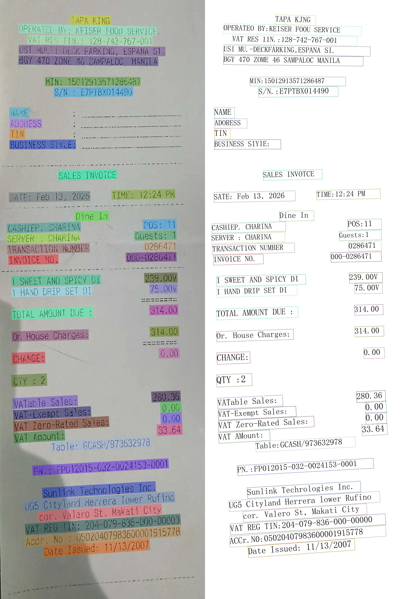
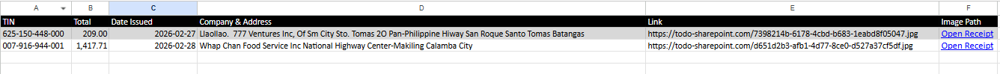

#  Resibobo

Resibobo is an OCR-powered receipt parser designed to extract structured data from receipts and export them into CSV and Excel format for tax compliance.

---

#  Features

##  Receipt OCR Processing
- Extracts structured data from receipt images
- Supports batch processing
- Designed for cropped receipt images for better accuracy
- Uses PaddleOCR detection and recognition models

##  Intelligent Field Extraction
- Automatically extracts:
  - TIN (Tax Identification Number)
  - Total Amount
  - Date Issued
  - Company Name
  - Address
- Uses regular expressions for structured parsing
- Handles noisy OCR outputs and misspellings

##  CSV Export
- Generates structured CSV output
- One row per receipt

##  Excel Export
- Generates structured XLSX output
- One row per receipt

##  Performance Focused
- Uses PaddleOCR mobile models
- Designed for batch processing
- Optimized preprocessing using OpenCV cropping

---

#  Technologies Used

This project uses:

- OpenCV Image Cropping  
  https://opencv.org/cropping-an-image-using-opencv/

- PaddleOCR  
  https://github.com/PaddlePaddle/PaddleOCR?tab=readme-ov-file

- PP-OCRv5 Mobile Recognition Model
  https://huggingface.co/PaddlePaddle/PP-OCRv5_mobile_rec

- PP-OCRv5 Mobile Detection Model & Mobile
  https://huggingface.co/PaddlePaddle/PP-OCRv5_mobile_det

---

#  Notes

- The project may contain minor misspellings due to OCR limitations.
- Extraction accuracy depends on receipt image quality.
- Parsing uses regular expressions.
  - Extraction may fail if:
    - The receipt format is not yet supported by the regex
    - The image quality is poor
- This project currently runs on CPU.
  - Running large batches may exhaust CPU resources.
- This is an open project — feel free to contribute.

---

#  How to Run

1. Add your cropped receipt images to the `/receipts` directory.

2. Install dependencies:

```bash
pip install -r requirements.txt
```

3. Run the script:

```bash
python main.py
```

4. A CSV and Excel file will be generated in the `/output` directory.

---

#  Sample Output

| TIN               | Total   | Date Issued | Company & Address                                                                 | Link |
|-------------------|---------|------------|----------------------------------------------------------------------------------|------|
| 008-022-153-000   | 611.14  | 2026-02-16 | Grabit Foods Inc. Jollibee Waltermart Makiling Store #959 Brgy Makiling Nat Highway Calamba City | https://todo-sharepoint.com/1556d548-b279-443f-b392-376fcf23e15d.jpg |
| 009-433-354-000   | 1141.00 | 2619-02-16 | Caltex Sierra Makiling Gas Corporation Maharlika, Highway, San Antonio, Santo Tomas, Batangas | https://todo-sharepoint.com/517de74f-4b20-48d4-8734-1c122a1d5491.jpg |
| 000-122-954-000   | 2470.00 | 2026-02-04 | Greenfield Development Corp. Greenfield Tower Greenfield District, William St Cor. Mayflower St. Brgy. Highway Hills Mandaluyong City | https://todo-sharepoint.com/61e6be3c-676c-4ff2-b7eb-27f9c4c1b1ee.jpg |
| 128-742-767-001   | 314.00  | 2026-02-13 | Tapa King Operated By: Keiser Food Service | https://todo-sharepoint.com/7e428edc-0258-4efa-866f-5d0d14bd65a7.jpg |

---

#  Limitations

- Works best with clear, high-quality receipts.
- Image inferencing uses CPU.
- M1 / Mac machines may run slower due to memory usage.
- GPU significantly improves performance.
- Currently supports printed receipts only.
  - Not yet supported:
    - Grab
    - Food Panda
    - Manual receipts

---

#  Example Text Detection and Recognition



---

---

#  Example Excel Output



---

#  Future Improvements

- Improve data sanitization
- Add spelling autocorrection
- Add confidence score per extracted field
- Add GPU acceleration support
- Add support for digital receipts (Grab, FoodPanda)

---

#  Contributing

Contributions are welcome.  
Feel free to open issues or submit pull requests to improve parsing accuracy, performance, or add new receipt formats.

---